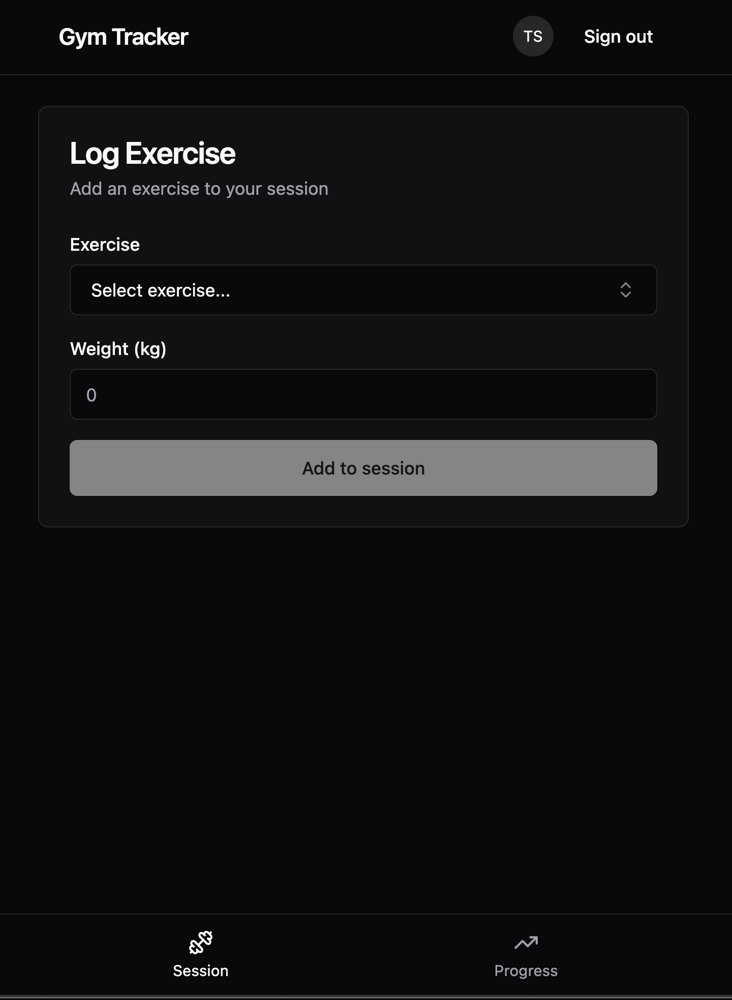

# Gym Tracker

A mobile-first web app for tracking gym sessions. Log exercises with a single weight value, view progress over time with line charts.

<p align="center">
  
</p>

## Stack

| Layer    | Tech                                               |
| -------- | -------------------------------------------------- |
| Frontend | React, TypeScript, Vite, shadcn/ui, Recharts       |
| Backend  | Google Apps Script (action-based routing)          |
| Storage  | Google Sheets (append-only log as source of truth) |
| Auth     | Google Sign-In (ID token verification)             |
| Hosting  | GitHub Pages (CI/CD via GitHub Actions)            |

## Features

- **Session logging** — pick an exercise, enter weight, save. Exercises auto-complete from history.
- **Progress charts** — weight-over-time line charts per exercise, lazy-loaded for fast initial page load.
- **Offline resilience** — session state backed up to localStorage, resume prompt on reopen.
- **Zero infrastructure cost** — Google Sheets as the database, Apps Script as the API, GitHub Pages for hosting.

## Running locally

```bash
bun install
bun dev
```

Requires a `.env.local` with `VITE_GOOGLE_CLIENT_ID` and `VITE_APPS_SCRIPT_URL`.

## Deployment

Both halves ship automatically on push to `main` via GitHub Actions:

- **Frontend** → built and published to GitHub Pages.
- **Backend** (`apps-script/**` changes only) → `clasp push` followed by `clasp deploy`, which cuts a new version on the pinned web-app URL — so the live endpoint actually serves the new code, not just the editor.
